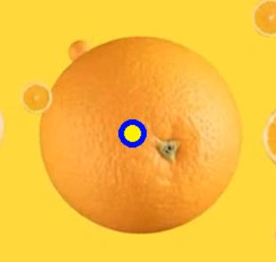

# Orange-detection-and-tracking using Kalman Filter

Kalman filtering, also known as linear quadratic estimation (LQE), is an algorithm that uses a series of measurements observed over time, including statistical noise and other inaccuracies, and produces estimates of unknown variables that tend to be more accurate than those based on a single measurement alone, by estimating a joint probability distribution over the variables for each timeframe. The filter is named after Rudolf E. Kálmán, who was one of the primary developers of its theory.

Following steps taken:
1. Find out the Low and High values of Orange color to detect the color in the image.
2. Pass the detection co-ordinates to Kalman Filter.
3. Get the predicited co-ordinates and plot them with the original ones.

The Blue circle is the Kalman filter prediction and the Yellow dot is the original position. In the video it can be seen that Kalman filter needs just few positions to correctly predict the next position.
Video can be found here.

References:
Wikipedia: https://en.wikipedia.org/wiki/Kalman_filter
